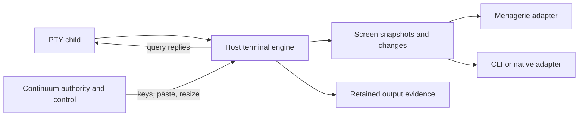

# Terminal/session release crib sheet

**Reviewed 9 September 2026. Planning input, not a locked architecture or an implementation claim.**

**Recommendation:** keep Continuum’s Go runtime and move the server-side terminal decision ahead of broader remote/client work. Evaluate a headless VT engine behind a small interface; retain Menagerie’s current browser adapter while testing a screen-based adapter. These repositories supply designs and test cases, not evidence that a drop-in dependency meets our contract.

**Evidence:** four requested repositories were cloned and their relevant code, features, documentation and test definitions read. Ghostex’s pinned zmx dependency was also checked out to verify its persistence layer. No upstream app, installer, benchmark or test suite was run. Ghostex’s large UI and uninitialised mobile/web/CEF submodules were not exhaustively reviewed. Every external code link below pins the inspected commit; full revisions and local clone paths are in the [source manifest](terminal-session-sources-2026-09-09.json).

## 1. Four projects, four useful lessons

| Project / pinned revision | What the inspected code does | Most useful to us | Boundary to remember |
|---|---|---|---|
| **tmax** · `844eddd` | Python/shell tooling over tmux; local/remote chooser, SSH control-mode bridge, topology sync and lifecycle-derived agent indicators. | Host/session discovery, explicit offline state, identity checks, remote commands without nested prefixes. | tmux supplies the terminal engine. Scrollback import and arbitrary command translation are incomplete. |
| **Ghostex** · `0e177a1` | Rust/GPUI desktop terminal rendering with libghostty-vt; gxserver service; a customised zmx process/session layer. Rich chat, project and remote-client surfaces. | Separate process lifetime from client lifetime; bounded current-screen reads; terminal/chat views of the same agent. | A broad application with substantial platform/build machinery. Process-preserving detach is different from daemon replacement or conversation resume. |
| **stacks2099** · `7c0d19e` | Rust/Nushell workspace whose event log projects clips/layout into HTML; wezterm-term owns live terminal state server-side. | Product/workspace identity independent of process identity; server-projected views; per-tab focus. | Superseded by ptyZZZ. Layout restoration can spawn a new process; it does not restore the old process. |
| **ptyZZZ** · `d23e046` | One PTY plus wezterm-term, JSONL commands in, HTML screen/diff frames out; transport and fan-out supplied by an adapter. | Small terminal-worker boundary, semantic input, snapshots, row damage, coalescing and resynchronisation. | Not a host daemon, auth system, durable journal or cross-host coordinator. Its demos do not implement our control-lease contract. |

Primary entry points: [tmax](https://github.com/theo-kirby/tmax/blob/844edddf1f0d7271c598c71e97e6be706decb5d6/README.md), [Ghostex](https://github.com/maddada/Ghostex/blob/0e177a191177bca0c48c51e04c75a785125f7a19/README.md), [stacks2099 successor notice](https://github.com/cablehead/stacks2099/blob/7c0d19eeb8c56ac8826480cb491bc055ca188a8b/README.md), [ptyZZZ](https://github.com/cablehead/ptyZZZ/blob/d23e046dff3b389d0a8a70929087bbfb2007ee5e/README.md).

## 2. What “server-side terminal” means for Continuum

Continuum alpha has a PTY byte path, a retained event journal and a browser using xterm.js. It has **no canonical VT screen model**. Its `/bin/cat` walkthrough established shared process/output observation, not full-screen TUI recovery or detached terminal-query handling. See [PTY implementation](internal/pty/session.go:78), [journal](internal/journal/journal.go:235) and [alpha contract](docs/local-alpha.md).

Keep these guarantees separate:

| Guarantee | What must survive / be reconstructed | Current alpha |
|---|---|---|
| Work identity | Block/session metadata | Persisted. |
| Output evidence | Retained events, with explicit gaps and uncertainty | Persisted within budget. |
| Terminal presentation | Grid, cursor, primary/alternate screen, modes, scrollback and dimensions | Not modelled server-side. |
| Live execution | Existing process and kernel state | Survives client disconnect; not daemon restart. |
| Agent conversation | Provider-specific conversation reference and resume semantics | Inherited legacy ACP support; no blanket restore guarantee. |

The stacks journey explains two failures worth testing: a bounded raw replay can start mid-sequence, and a detached program may wait for a terminal query response. Its author reports that projecting one server-owned grid eliminated their observed corruption. That is experience from this project, not proof that every two-emulator architecture fails. tmux/zmx-style repaint protocols can coexist with a client emulator; the crucial requirement is a defined authoritative state and query-response path. [Read the journey](https://github.com/cablehead/stacks2099/blob/7c0d19eeb8c56ac8826480cb491bc055ca188a8b/journey.md); [zmx daemon/client implementation](https://github.com/maddada/zmx/blob/bf63622fab579ebf21ee782a876c7dbc4339d817/src/loop.zig).

A proposed boundary, independent of transport or renderer:

A screen snapshot is a view artifact; it is not automatically a serialised emulator checkpoint suitable for restarting the parser. An HTML frame does not preserve every terminal mode or restore a process.

## 3. Code notes to revisit during implementation

### tmax: remote sessions that remain recognisable

- `DirectControl` parses tmux `%begin/%end/%output`; `control_serve` shares one SSH/tmux control client among panes in a remote session. Each pane has a local bridge. Slow peer buffers have a 4 MiB disconnect threshold. Prefer this current code over the older per-pane SSH-channel description in `REMOTE-PLAN.md`. [Bridge and shared control](https://github.com/theo-kirby/tmax/blob/844edddf1f0d7271c598c71e97e6be706decb5d6/scripts/remote.py).
- Reconnect checks remote server PID plus session creation time before trusting reused tmux IDs. `repaint` fetches the visible grid and restores cursor, scroll region and selected modes. It does not import complete scrollback. Copy the identity rule and the bounded expectations, not a promise of perfect byte replay. [prepare, sync and repaint](https://github.com/theo-kirby/tmax/blob/844edddf1f0d7271c598c71e97e6be706decb5d6/scripts/remote.py).
- Discovery refreshes cached host/session information without blocking chooser input. Hook state includes PID/start identity; aggregation prioritises waiting over working. Fallback screen heuristics remain fallible. Our event model should preserve the source and freshness of a status, never turn an inferred “waiting” into an approval decision. [Agent state collector](https://github.com/theo-kirby/tmax/blob/844edddf1f0d7271c598c71e97e6be706decb5d6/scripts/agent_status.py).
- Its SSH lease uses boot identity and fixed expiry and prevents background fallback to a fresh login. Its key-plus-password server policy is a product choice, not our default. Borrow fail-closed reconnect and distinguish host authentication from a block’s controller lease. [SSH lease implementation](https://github.com/theo-kirby/tmax/blob/844edddf1f0d7271c598c71e97e6be706decb5d6/scripts/auth.py).

### Ghostex: persistent processes behind several views

- The active native path is **libghostty-vt state + GPUI rendering**; retained GhosttyKit code is not the selected engine. The architecture document contains older path/platform descriptions, so use the engine and model code to resolve it. [Active engine](https://github.com/maddada/Ghostex/blob/0e177a191177bca0c48c51e04c75a785125f7a19/apps/desktop/src/terminal_gpui_engine.rs); [Owned render snapshots](https://github.com/maddada/Ghostex/blob/0e177a191177bca0c48c51e04c75a785125f7a19/apps/desktop/src/terminal_model.rs).
- Persistence comes through its pinned **zmx fork (`bf63622`)**, whose daemon also imports Ghostty VT. gxserver resolves attach metadata, then the WebSocket path launches a zmx attachment process. Disconnecting that attachment is distinct from terminating the persistent agent. This is evidence for a process-host boundary, not a reason to add a second competing Continuum registry. [WebSocket attach path](https://github.com/maddada/Ghostex/blob/0e177a191177bca0c48c51e04c75a785125f7a19/server/src/terminal_ws.rs); [zmx daemon VT loop](https://github.com/maddada/zmx/blob/bf63622fab579ebf21ee782a876c7dbc4339d817/src/loop.zig).
- Current-screen capture bounds data at the source: active alternate screen alone, or primary screen plus recent scrollback. It uses an ordered capability probe/fallback for older daemons. This is a better agent perception primitive than repeatedly transferring full history. [Bounded capture](https://github.com/maddada/Ghostex/blob/0e177a191177bca0c48c51e04c75a785125f7a19/server/src/zmx/screen_capture.rs).
- `wire_cycle.rs` documents an upgrade failure: cycling on binary identity killed running sessions even for compatible changes. Its correction uses an explicit wire generation. An incompatible cycle still kills the process; provider resume restores conversation, not background jobs. For Continuum, make disruption visible and keep mixed-version compatibility explicit. [Upgrade lesson](https://github.com/maddada/Ghostex/blob/0e177a191177bca0c48c51e04c75a785125f7a19/server/src/zmx/wire_cycle.rs).
- Chat reads the agents’ structured JSONL transcripts, with bounded initial reads and snapshot/append/replace/state events. Terminal bytes are not its universal chat schema. Menagerie can prefer ACP where available and add provider adapters without making screen scraping authoritative. [Transcript projection](https://github.com/maddada/Ghostex/blob/0e177a191177bca0c48c51e04c75a785125f7a19/server/src/session_chat.rs).

### stacks2099: durable workspace, live processes, local focus

- `projection.nu` folds clip/stack events while remaining PTY-agnostic. The app binds a clip to a live PTY separately. On a fresh server its bootstrap respawns terminal clips: placement survives, execution restarts. This maps naturally to workspace → block → execution-attempt identities. [Pure projection](https://github.com/cablehead/stacks2099/blob/7c0d19eeb8c56ac8826480cb491bc055ca188a8b/app/projection.nu); [Session binding and bootstrap](https://github.com/cablehead/stacks2099/blob/7c0d19eeb8c56ac8826480cb491bc055ca188a8b/app/serve.nu).
- The reader feeds wezterm-term beside the PTY; its writer also handles terminal replies. Viewers render HTML. Raw-stream subscribers are bounded and cannot stall the reader. This is useful separation of capture, screen and viewing. [PTY, screen, raw tee and view paths](https://github.com/cablehead/stacks2099/blob/7c0d19eeb8c56ac8826480cb491bc055ca188a8b/src/pty.rs).
- Per-tab navigation focus became client-owned after shared selection and network round trips caused races. The ADR still identifies a shared add-cursor follow-up. For Menagerie, local highlight/scroll/selection should not become controller ownership or clear another viewer’s attention. [Focus decision](https://github.com/cablehead/stacks2099/blob/7c0d19eeb8c56ac8826480cb491bc055ca188a8b/docs/adr/0006-client-owned-cursor.md).
- HTML does not make terminal UI effortless: keyboard/IME, copy, scroll pinning, fonts and permissions remain client work. Its OSC 52 document explicitly describes unwired clipboard handling. [Clipboard boundary](https://github.com/cablehead/stacks2099/blob/7c0d19eeb8c56ac8826480cb491bc055ca188a8b/docs/osc52-clipboard.md).

### ptyZZZ: a small engine with a useful wire contract

- Input supports **semantic key, paste, raw UTF-8, resize and screen request**. Keys/paste are encoded against the live terminal modes; the PTY and engine share a writer. This avoids a remote browser guessing application-cursor or bracketed-paste state. [Protocol](https://github.com/cablehead/ptyZZZ/blob/d23e046dff3b389d0a8a70929087bbfb2007ee5e/PROTOCOL.md); [PTY and input implementation](https://github.com/cablehead/ptyZZZ/blob/d23e046dff3b389d0a8a70929087bbfb2007ee5e/src/main.rs).
- The emitter caches rendered rows, suppresses byte-identical output and sends keyframes for initial state, resize and alternate-screen changes. Defaults are 16 ms pacing, 3,000 scrollback lines and a 5-second healing interval after diff activity. These are implementation defaults, not measured targets for our product. [EmitState and emitter](https://github.com/cablehead/ptyZZZ/blob/d23e046dff3b389d0a8a70929087bbfb2007ee5e/src/main.rs).
- Diffs name the **last emitted base**, because engine damage counters can skip numbers. Our envelope also needs host/block identity, execution epoch and geometry generation. A subscriber must reject a mismatched base and request a fresh snapshot. Test the full adapter: the inspected `serve.nu` path turns diffs directly into Datastar patches without checking `base`, and stores keyframe HTML without the full JSON envelope. The protocol’s field alone does not establish end-to-end gap handling. [Diff contract](https://github.com/cablehead/ptyZZZ/blob/d23e046dff3b389d0a8a70929087bbfb2007ee5e/PROTOCOL.md); [Reference adapter](https://github.com/cablehead/ptyZZZ/blob/d23e046dff3b389d0a8a70929087bbfb2007ee5e/serve.nu).
- The cross.stream adapter retains the latest keyframe and makes diffs ephemeral. It requests a fresh frame **after** the replay/live barrier. One stream multiplexes panes. This is a useful pattern for live viewing, but cannot replace Continuum’s retained output history or audit records. [Topic retention and join sequence](https://github.com/cablehead/ptyZZZ/blob/d23e046dff3b389d0a8a70929087bbfb2007ee5e/serve.nu).
- Its demo lets each tab resize the shared PTY; the code calls this last-viewer-wins. Retain Continuum’s fenced controller. Also, stdin EOF normally kills the worker’s child; it is not a daemon-restart-survival mechanism. [Browser fit/input path](https://github.com/cablehead/ptyZZZ/blob/d23e046dff3b389d0a8a70929087bbfb2007ee5e/serve.nu); [Worker lifetime](https://github.com/cablehead/ptyZZZ/blob/d23e046dff3b389d0a8a70929087bbfb2007ee5e/src/main.rs).

## 4. Engine decision: evaluate a component, keep the runtime

| Candidate | Why evaluate it | Gate before adoption |
|---|---|---|
| **wezterm-term in a bounded Rust component** | Closest inspected reference: server grid, stable row identity, damage and mode-aware input. | Pin/build maintenance, terminal compatibility, resource limits and process ownership. Existing ptyZZZ owns its PTY; adapt it deliberately or expose a parser-only interface. |
| **libghostty-vt through a C ABI** | Ghostex demonstrates native state/render separation; zmx demonstrates persistent server use. | Go/CGO or helper packaging, pinned Zig/toolchains, cell readback cost, scrollback identity, query/capability behavior. |
| **rio-vt** | ptyZZZ’s ADR records a smaller dependency alternative. | Re-run its comparison against our workload and verify stable-row/input semantics. The alternative branch was not executed here. |
| **tmux-backed compatibility option** | tmax demonstrates remote control; Menagerie already has legacy tmux behavior. | Keep tmux ownership explicit, preserve our auth/control semantics, and avoid treating incomplete screen capture as a complete snapshot. |

ptyZZZ’s ADR retains wezterm-term, keeps rio-vt as a candidate, and reports workload-specific disadvantages for its Ghostty port. Its numbers are **author-reported, not reproduced here**. It also explicitly corrects kitty-keyboard claims: the evaluated implementations do not provide full kitty encoding. Use its harness design; do not inherit its engine verdict without our own compatibility and cost measurements. [Engine evaluation](https://github.com/cablehead/ptyZZZ/blob/d23e046dff3b389d0a8a70929087bbfb2007ee5e/docs/adr/0001-terminal-emulation-crate.md).

**One shared product runtime remains feasible.** A Rust helper would mean one distributed product with an additional executable/process, not literally one OS executable. A linked library can preserve one executable but adds FFI/toolchain work. Both products must still use one Continuum session registry and control authority. Select packaging after the engine spike; no whole-runtime Rust rewrite is recommended by this research.

## 5. Proposed release sequence

These are candidate gates, not committed versions or dates. Public Menagerie source distribution and installed-service migration remain separate prerequisites.

| Gate | Deliverable | Acceptance / useful references |
|---|---|---|
| **R1 — Terminal correctness spike** | Headless engine seam; canonical screen/query authority; truthful capabilities. | Detached DA/DSR/colour queries receive exactly one correct reply. Reattach into a full-screen TUI after output exceeds journal retention. Compare wezterm/Ghostty on our corpus. ptyZZZ and zmx. |
| **R2 — Reliable interactive clients** | CLI attach; experimental screen adapter in Menagerie; fenced key/paste/resize; snapshot/live handoff. | Lose/reorder/duplicate diffs; reconnect during resize and alt-screen switch; stale bases rejected. Two observers cannot resize or answer terminal queries. Test IME, paste, Ctrl-C, wide glyphs, mouse and declared keyboard modes. |
| **R3 — Remote session continuity** | Explicit process-host/upgrade contract; unified host discovery; multiplexed remote observation. | Disconnect, host restart, daemon upgrade and conversation resume each produce their documented outcome. Cached offline hosts stay visibly stale; old/new peers negotiate capabilities. tmax discovery and Ghostex wire generation. |
| **R4 — Agent/workspace composition** | Source-labelled event streams, Nushell merge, durable broker; bounded screen perception; optional terminal/chat views. | A quiet source cannot stall another; cancellation and broker restart are tested. Unknown transcript records do not disappear silently. Keep observational status separate from approval authority. |
| **Later — Native client and richer workspace** | Native rendering, rich prompt editor, mixed notes/URLs/jobs, mobile ergonomics as needed. | Adopt only after existing clients expose measured limitations. Keep workspace focus local; reuse the established runtime contract. Ghostex and stacks2099. |

## 6. Test checklist to copy into a workplan

- **TC1 Detached queries:** no browser attached; DA1/DA2, DSR and supported OSC queries; exactly one responder, no indefinite block.
- **TC2 Screen recovery:** split escape/UTF-8 writes, retention eviction, cursor/pen/modes, primary/alternate screen and scrollback; compare reconstructed screen to the authoritative engine.
- **TC3 Snapshot race:** subscribe barrier, capture, concurrent output, dropped/duplicated/out-of-order frames and stale epochs; catch up without silent corruption.
- **TC4 Input authority:** controller takeover during queued key/paste/resize; observers and hidden views cannot mutate; no replay of uncertain keystrokes after reconnect.
- **TC5 Terminal compatibility:** Vim/htop-like redraws, real supported agent TUIs, resize/reflow, emoji/CJK/combining marks, hyperlinks, IME, bracketed paste, mouse, clipboard and image protocols. Publish unsupported capabilities.
- **TC6 Failure semantics:** client close, network drop, engine failure, daemon replacement and host reboot separately; same PID versus new attempt/conversation is visible.
- **TC7 Resource isolation:** firehose, 10–50 panes/viewers, a stalled renderer, large scrollback and full disk; bounded queues and frame bytes; output capture failure remains explicit.
- **TC8 View safety:** escape text/attributes, allowlist clickable URL schemes, gate clipboard/file effects, and reject oversized frames/commands. HTML from a terminal is a protocol surface.
- **TC9 Upgrade compatibility:** old client/new daemon and inverse; additive capabilities need not cycle processes; incompatible changes show disruption before execution.
- **TC10 Composition:** a single multiplexed connection, source identity/order, gap reporting, consumer cancellation, durable versus ephemeral retention and reproducible Nushell consumption.

Harness starting points inspected: [tmux control probe](https://github.com/theo-kirby/tmax/blob/844edddf1f0d7271c598c71e97e6be706decb5d6/test/control_mode_test.py), [shared channel tests](https://github.com/theo-kirby/tmax/blob/844edddf1f0d7271c598c71e97e6be706decb5d6/test/shared_control_test.py), [status tests](https://github.com/theo-kirby/tmax/blob/844edddf1f0d7271c598c71e97e6be706decb5d6/test/agent_status_test.py), [diff-base tests](https://github.com/cablehead/ptyZZZ/blob/d23e046dff3b389d0a8a70929087bbfb2007ee5e/src/main.rs), [keyboard end-to-end harness](https://github.com/cablehead/ptyZZZ/blob/d23e046dff3b389d0a8a70929087bbfb2007ee5e/bench/keytest.nu), [terminal workload benchmarks](https://github.com/cablehead/ptyZZZ/blob/d23e046dff3b389d0a8a70929087bbfb2007ee5e/bench/e2e.nu), [browser smoke definitions](https://github.com/cablehead/stacks2099/blob/7c0d19eeb8c56ac8826480cb491bc055ca188a8b/tests-browser/smoke.test.mjs). Adapt their isolation/cleanup to our verifier before running them; their presence is not a passing result.

## 7. Reuse and planning boundaries

- ptyZZZ and stacks2099 declare MIT; Ghostex and its pinned zmx fork contain MIT-form permission text. Preserve notices and inventory transitive licenses if code is incorporated. tmax has no license declaration identified in its 22 tracked files: use it as a design reference pending clarification. The source manifest records what was observed, not a legal compatibility opinion.
- Preserve Continuum’s current observer/control and journal guarantees. HTML projection, Datastar, cross.stream, GPUI, CEF, a new database and QUIC are independently selectable choices, not a single package deal.
- Do not equate no viewers with no need for a terminal engine; do not equate HTML replay with process persistence; do not equate a renewed conversation with an uninterrupted agent.
- No runtime code, installed service, source ownership, or pending-release commitment changes as part of this research. Use R1–R4 and TC1–TC10 as inputs to the next planning pass.
